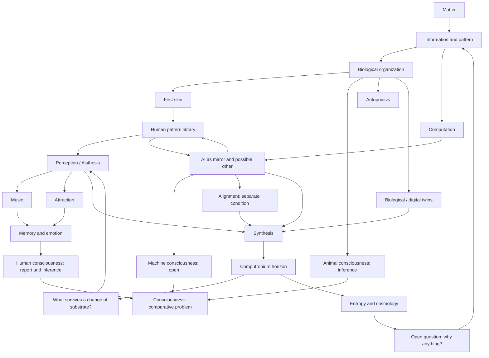

# Concept map

The project is better represented as a recursive graph than as a hierarchy.

## Important edges

- **Matter → information:** physical states can carry information; this does not mean all matter computes or experiences.
- **Biology → first skin:** the body is both constraint and instrument.
- **First skin → human pattern library:** perception and culture make some regularities salient while leaving others difficult or impossible to recognize.
- **Human patterns ↔ AI:** AI can intensify inherited human categories or expose representations that are not intuitive to an individual observer; neither direction guarantees escape from anthropocentrism.
- **Animal / human / machine → consciousness:** each case offers different evidence and uncertainty; language, intelligence, and behavior cannot be used as automatic substitutes for experience.
- **AI → alignment:** greater capability does not guarantee beneficial continuation, and alignment does not prove consciousness.
- **Aisthesis → music / attraction:** both begin in situated perception, but they are not identical mechanisms.
- **Information → computation:** computation transforms information; information can exist without being computation in the same operational sense.
- **AI → mirror:** AI can reorganize thought, expose blind spots, or reinforce self-confirming loops. It is neither neutral nor guaranteed truthful.
- **Digital twin → Synthesis:** operational models can connect living measurement and computation without becoming the organism itself.
- **Synthesis → Computronium:** reconciliation opens the question of future substrates; it does not prove substrate continuation.
- **Computronium → Aisthesis:** maximizing computation reopens the problem of experience, body, music, attraction, and feeling.
- **Entropy → why:** even a successful cosmological or computational mechanism would not answer why there is a mechanism at all.

The mirror does not guarantee truth; it makes hypotheses visible.
